# SCALE Agent OS Fusion Design

Status: implemented through Agent OS V2 runtime
Owner: engineering governance
Date: 2026-06-28
Scope: evolve SCALE from workflow engine to Agent OS while preserving evidence-first governance

## 1. Executive Summary

SCALE should not stop at "workflow". The next product shape should be:

```text
SCALE = Agent OS Kernel + Governance Control Plane + Capability Runtime + Agent Workbench
```

The current workflow engine already has the right foundation: Shield, Orchestrator, Cortex, Context Compiler, Tool Orchestrator, Runtime Evidence, Memory Brain, Skill Radar, Agent Coordinator, and Dashboard. The missing step is to make these modules behave like an operating system for agents:

- every task has durable state, events, evidence, checkpoint, and completion signal
- every capability is declared, discoverable, governed, and measurable
- every UI action has CLI/API/tool parity, and every agent action is visible to users
- every memory and rule promotion is evidence-backed and reversible
- every surface, including CLI, dashboard, desktop, IM, bridge, and remote connector, shares the same kernel

The guiding principle:

```text
Workflow is the UX.
Agent OS is the runtime contract underneath it.
```

## Implementation Status

Implemented on 2026-06-28:

- V1.1 kernel hardening: task schema/correlation IDs, filtered task lists, timeline reconstruction, validation-required completion, ledger event expansion.
- V1.2 Capability Registry 2.0: project-scoped capability descriptors, trust/disable lifecycle, provider/connector support, parity-aware capability reports.
- V1.3 Bridge and Management API: `.scale/bridges.json`, token-hash bridge registration, heartbeat events, `/api/v1/events`, SSE stream, bridge API, CLI, and MCP tools.
- V1.4 Workbench UX/API: `/api/v1/workbench`, task-focused workbench snapshots, dashboard Agent OS tab, evidence/memory/git/bridge/capability/task panels.
- V1.5 Smart Shell and Execution Supervisor: command risk classification, destructive/credential blocking, shell history, command-run evidence, CLI and MCP shell tools.
- V2.0 Multi-Agent Orchestrator and Cortex Promotion: durable delegation assignments, role/review decisions, shadow-rule promotion pipeline, CLI and MCP tools, ledger-backed events.

The remaining work is product expansion, not kernel enablement: hosted bridge auth, richer approval UI, editor/desktop shell packaging, and release/PR automation.

## 2. What SCALE Should Become

### 2.1 Product Definition

SCALE Agent OS is a local-first, evidence-driven runtime for engineering agents. It owns:

| Layer | Responsibility | Existing SCALE baseline |
| --- | --- | --- |
| Task Kernel | task lifecycle, checkpoint, resume, explicit completion | Orchestrator, AgentCoordinator, RuntimeEvidence |
| Context Kernel | context pack, lazy loading, token budget, dynamic refresh | ContextCompiler, ContextBudget |
| Capability Plane | tools, skills, MCP, CLIs, providers, connectors, policies | ToolOrchestrator, ToolPolicy, SkillRadar |
| Memory Plane | project facts, incidents, decisions, contradictions, lessons | MemoryBrain, MemoryFabric, Cortex |
| Safety Plane | policy compilation, gates, approvals, workspace boundary | Shield, GateSystem, ResourceGovernance |
| Surface Plane | CLI, dashboard, API, bridge, desktop, IM, remote control | CLI, DashboardServer, adapters |
| Evolution Plane | failure replay, shadow rules, ROI, promotion workflow | Cortex, Eval, GovernanceROI |

### 2.2 Non-Goals

SCALE should not become:

- a monolithic IDE clone
- a single-agent chatbot wrapper
- a prompt pack without runtime contracts
- an automatic code-modifying daemon
- a system that silently promotes one-session observations into blocking rules
- a surface-specific product where the dashboard, CLI, and agents disagree about state

### 2.3 Design North Star

SCALE should make an agent feel as if it has an OS:

- it can inspect available capabilities
- it can request context instead of reading everything
- it can start, pause, resume, delegate, verify, and complete work
- it can write evidence and learn from failures
- it can use UI, CLI, MCP, browser, desktop, and external adapters through one governed contract
- it cannot bypass workspace boundaries, approvals, gates, or evidence requirements

## 3. Reference Project Learnings

This plan borrows patterns from the five local reference projects without copying their product scope wholesale.

| Project | What to learn | What to avoid |
| --- | --- | --- |
| `cc-connect` | multi-project process binding, provider registry, bridge protocol, WebSocket connectors, management API, cron, heartbeat, session resume, platform adapters | turning SCALE into only an IM gateway |
| `cc-code` | microkernel services, plugin manager, event bus, Smart Shell, long-term task checkpoints, knowledge base, self-evolution settings | letting plugin sprawl weaken governance |
| `cc-haha` | desktop workbench, sidecar architecture, visual diff, permission approvals, H5/IM access, memory taxonomy, skill sources, agent teams, computer-use safety layers | coupling OS kernel to one desktop UI |
| `hermes-agent` | middleware and observer contracts, robust MCP runtime, progressive skill disclosure, gateway relay, multi-backend execution, self-learning skills | fail-open middleware for security-sensitive gates |
| `terax-ai` | terminal-first ADE, Rust-owned OS boundary, workspace authorization, explicit tool approvals, read-before-edit, secret-path denylist, background process logs, agent activity markers | duplicating an editor instead of exposing SCALE as a kernel |

The fusion should preserve SCALE's identity:

```text
SCALE owns governance, evidence, state, and evolution.
Other surfaces and tools provide optional execution reach.
```

## 4. Agent-Native Architecture Requirements

### 4.1 Parity

Every meaningful operation must have parity across surfaces:

| Operation | CLI | API | Dashboard | Agent Tool |
| --- | --- | --- | --- | --- |
| create task | `scale task create` | `POST /api/v1/tasks` | New task form | `task_create` |
| inspect task | `scale task status` | `GET /api/v1/tasks/:id` | Task panel | `task_read` |
| checkpoint | `scale task checkpoint` | `POST /api/v1/tasks/:id/checkpoints` | Timeline action | `task_checkpoint` |
| complete | `scale task complete` | `POST /api/v1/tasks/:id/complete` | Completion review | `complete_task` |
| list capabilities | `scale capability list` | `GET /api/v1/capabilities` | Capability matrix | `capability_list` |
| request approval | `scale approval request` | `POST /api/v1/approvals` | Approval tray | `approval_request` |
| record evidence | `scale evidence add` | `POST /api/v1/evidence` | Evidence timeline | `evidence_record` |

Dashboard-only features are not allowed. Agent-only side effects are not allowed. The shared source of truth is the SCALE kernel state and event ledger.

### 4.2 Granularity

Primitive tools must stay atomic:

- read file
- search files
- write proposed patch
- run command
- record evidence
- create checkpoint
- ask for approval
- query memory
- request context refresh
- complete task

Higher-level workflows may compose these primitives, but must not hide the primitives from agents.

### 4.3 Composability

New product behaviors should be mostly implemented as:

- capability descriptors
- skill packs
- prompt/context packs
- policy rules
- adapters
- gates
- dashboard views over existing state

Only add code when the behavior needs a new primitive, new state transition, or new safety boundary.

### 4.4 Emergent Capability

SCALE should discover repeated unsupported requests from runtime evidence:

```text
unsupported request
  -> repeated pattern
  -> candidate primitive or capability descriptor
  -> shadow evaluation
  -> reviewed capability
  -> default recommendation
```

The system should graduate capabilities from evidence, not from marketing desire.

### 4.5 Explicit Completion

Agents must not finish by simply stopping text output. Every task run needs an explicit completion signal:

```text
complete_task({
  taskId,
  outcome: "complete" | "partial" | "blocked" | "cancelled",
  evidenceIds,
  changedFiles,
  validation,
  residualRisk,
  nextActions
})
```

Partial completion is a first-class state. A long-running task may checkpoint and resume without pretending the work is done.

## 5. Target Architecture

```mermaid
flowchart TD
  U["User / Agent / Connector"] --> S["Surface Plane"]
  S --> K["Agent OS Kernel"]
  K --> T["Task Kernel"]
  K --> C["Context Kernel"]
  K --> P["Capability Plane"]
  K --> M["Memory Plane"]
  K --> G["Safety Plane"]
  K --> E["Evolution Plane"]

  S --> S1["CLI"]
  S --> S2["Dashboard"]
  S --> S3["Management API"]
  S --> S4["Bridge / IM / Remote"]
  S --> S5["Desktop Workbench"]

  T --> T1["Task FSM"]
  T --> T2["Execution Ledger"]
  T --> T3["Checkpoint Store"]
  T --> T4["Completion Contract"]

  C --> C1["Context Compiler"]
  C --> C2["Dynamic Refresh"]
  C --> C3["Budget / Omitted Reasons"]

  P --> P1["Skill Registry"]
  P --> P2["MCP Registry"]
  P --> P3["CLI Registry"]
  P --> P4["Provider Registry"]
  P --> P5["Connector Registry"]

  M --> M1["Facts"]
  M --> M2["Decisions"]
  M --> M3["Incidents"]
  M --> M4["Contradictions"]

  G --> G1["Shield"]
  G --> G2["Approval"]
  G --> G3["Workspace Boundary"]
  G --> G4["Gate System"]

  E --> E1["Failure Replay"]
  E --> E2["Shadow Rule"]
  E --> E3["Governance ROI"]
```



## 6. Core Runtime Contracts

### 6.1 Task Kernel

The Task Kernel is the OS process table for agent work.

Proposed states:

```text
Created
  -> Planned
  -> Running
  -> WaitingForApproval
  -> WaitingForExternalInput
  -> Verifying
  -> Completed
  -> PartiallyCompleted
  -> Blocked
  -> Cancelled
```

Required artifacts:

| Artifact | Purpose |
| --- | --- |
| task manifest | owner, level, scope, objective, workspace, surfaces |
| run manifest | agent, model, provider, start time, context pack, policy mode |
| checkpoint | last known state, remaining steps, open approvals, evidence links |
| completion record | final outcome, changed files, validation, risk, next actions |

Implementation direction:

- extend `AgentCoordinator` from simulated team execution toward durable task runs
- connect `ExecutionLedger` and `RuntimeEvidenceLedger` as the canonical timeline
- add explicit `complete_task` semantics to CLI/API/tool contracts
- support background execution without losing task state on process exit

### 6.2 Capability Plane

Capability descriptors are the OS device table for agents.

Draft schema:

```ts
interface CapabilityDescriptor {
  id: string
  kind: 'skill' | 'mcp' | 'cli' | 'provider' | 'connector' | 'browser' | 'desktop'
  displayName: string
  version?: string
  status: 'available' | 'missing' | 'disabled' | 'blocked' | 'degraded'
  trust: 'trusted' | 'review-required' | 'restricted' | 'blocked'
  operations: CapabilityOperation[]
  inputs?: Record<string, unknown>
  outputs?: Record<string, unknown>
  sideEffects: ('read' | 'write' | 'network' | 'process' | 'credential' | 'destructive')[]
  requiredEvidence: string[]
  approvalPolicy: 'none' | 'on-write' | 'on-risk' | 'always'
  fallback?: string
  healthCheck?: string
}
```

Borrowed patterns:

- from `cc-connect`: external connectors register capabilities over a bridge
- from `hermes-agent`: MCP lifecycle, transports, reconnect, OAuth recovery, and skill progressive disclosure
- from `cc-code`: plugin manifests, dependencies, conflicts, and hooks
- from `terax-ai`: workspace authorization and secret-path denylist

Proposed commands:

```bash
scale capability list
scale capability doctor
scale capability map --task "..."
scale capability trust <id>
scale capability disable <id>
```

### 6.3 Context Kernel

Context must behave like virtual memory, not a pile of files.

Required behavior:

- compile a minimal context pack for the task
- show included, omitted, truncated, and refreshable items
- allow agents to request `refresh_context` with a reason
- track token budget and savings
- keep large reports, screenshots, and generated artifacts out of default context

Context pack additions:

```ts
interface ContextPackV2 {
  taskId: string
  budget: number
  included: ContextItem[]
  omitted: ContextOmission[]
  refreshHints: ContextRefreshHint[]
  capabilityHints: string[]
  memoryHits: string[]
  evidencePaths: string[]
}
```

### 6.4 Memory Plane

Memory should be operational, not sentimental. It should answer:

- what is true in this project
- what was decided
- what failed before
- what contradicts current assumptions
- what should be reverified because it may be stale

Borrowed patterns:

- from `cc-haha`: User, Feedback, Project, Reference memory classes
- from `cc-code`: typed knowledge base with access count, verified flag, supersedes, relationships
- from `hermes-agent`: skill and behavior improvement from trajectories

SCALE-specific rule:

```text
No active memory without evidence.
No global promotion without review.
No contradiction resolution without trace.
```

### 6.5 Safety Plane

The safety boundary must be hardcoded, not left to prompt judgment.

Required boundaries:

- workspace authorization and canonical path checks
- secret path denylist
- read-before-edit for mutation tools
- destructive command risk analysis
- approvals for dependency, hook, prompt, policy, release, and credential-adjacent changes
- browser/domain allowlists
- desktop automation disabled unless explicitly enabled
- connector capability scopes

Borrowed patterns:

- from `terax-ai`: OS access owned by native/backend layer, webview has no direct FS/process access
- from `cc-code`: Smart Shell risk analysis and safe alternatives
- from `cc-haha`: permission approval tray and computer-use safety gates
- from `hermes-agent`: middleware/observer separation, with SCALE keeping policy enforcement in the kernel

### 6.6 Surface Plane

Surfaces are clients of the same OS kernel.

| Surface | Role |
| --- | --- |
| CLI | canonical automation and scripting interface |
| Dashboard | inspect state, approve actions, compare evidence, render health |
| Management API | stable external control plane for dashboards, tray, TUI, CI, and automation |
| Bridge | WebSocket connector contract for IM and remote platforms |
| Desktop Workbench | optional richer workbench for diff, terminal, files, approvals, and live task timeline |

Minimum API contract:

```text
GET    /api/v1/status
GET    /api/v1/tasks
POST   /api/v1/tasks
GET    /api/v1/tasks/:id
POST   /api/v1/tasks/:id/checkpoints
POST   /api/v1/tasks/:id/complete
GET    /api/v1/capabilities
POST   /api/v1/approvals
GET    /api/v1/events?since=<cursor>
```

Bridge contract:

```text
connector -> register platform, project, session, capabilities
kernel    -> send task events, approval requests, notifications
connector -> send user messages, attachments, approvals, commands
kernel    -> persist everything as events and evidence
```

## 7. Fusion Modules

### Module A: Agent OS Contract

Purpose: define the durable kernel contract before building more features.

Deliverables:

- task FSM schema
- completion record schema
- capability descriptor schema
- API parity matrix
- event correlation IDs
- CLI/API/tool naming conventions

Acceptance criteria:

- every dashboard task operation maps to CLI/API/tool
- every agent-side state mutation emits an event
- task completion cannot be inferred from silence
- partial completion has a stable state and resume path

### Module B: Durable Task Runtime

Purpose: turn agent work from chat turns into resumable OS processes.

Deliverables:

- `.scale/tasks/<task-id>/task.json`
- `.scale/tasks/<task-id>/runs/<run-id>.json`
- `.scale/tasks/<task-id>/checkpoints/*.json`
- `scale task create/start/status/checkpoint/resume/complete`
- `complete_task` agent tool contract

Acceptance criteria:

- interrupted runs can be resumed with open evidence and next steps
- background tasks are visible in dashboard and CLI
- task completion links validation evidence and changed files
- blocked tasks preserve blocker reason and user-facing next action

### Module C: Capability Registry 2.0

Purpose: make tools, skills, MCP servers, providers, and connectors first-class OS capabilities.

Deliverables:

- `.scale/capabilities.json`
- `CapabilityDescriptor`
- capability doctor
- provider registry with project references
- MCP lifecycle health checks
- skill progressive disclosure and trust scan

Acceptance criteria:

- missing optional tools are explicit, not silent
- write-capable tools are restricted until trusted by policy
- connector capabilities are scoped per project/session
- low-confidence capability recommendations include fallback

### Module D: Bridge And Management API

Purpose: allow other surfaces to attach without becoming the source of truth.

Deliverables:

- `/api/v1` management API
- event stream via SSE or WebSocket
- bridge registration protocol
- connector capability descriptors
- token-based local auth

Acceptance criteria:

- external dashboard/TUI/tray can inspect tasks and approvals
- IM connector can resume sessions and send attachments
- no public inbound connector surface is required by default
- all remote actions become kernel events

### Module E: Smart Shell And Command Safety

Purpose: make command execution OS-grade.

Deliverables:

- command risk classifier
- destructive command patterns
- safe alternatives
- output cap and summarization
- timeout policy
- background process ring buffer
- command evidence normalization

Acceptance criteria:

- destructive commands require approval or are blocked by policy
- command output cannot flood context
- background commands can be inspected and stopped
- every command evidence record includes cwd, exit code, duration, summary, and redaction status

### Module F: Workbench UX

Purpose: provide a rich control surface without making SCALE an IDE clone.

Deliverables:

- task timeline
- capability matrix
- approval tray
- evidence browser
- changed-file and diff panel
- context pack inspector
- memory/contradiction inspector
- bridge/session monitor

Acceptance criteria:

- every UI action calls the same API as agents and CLI
- agent writes are visible in near real time
- users can approve, reject, or request changes with evidence context
- dashboard never becomes a separate state store

### Module G: Cortex Promotion Pipeline

Purpose: let SCALE improve from failures without unsafe self-modification.

Flow:

```text
failure evidence
  -> failure replay
  -> candidate lesson
  -> shadow rule
  -> evaluated rule
  -> approved rule
  -> optional blocking hook
```

Acceptance criteria:

- no blocking hook is created directly from a single observation
- shadow rules report hits and false positives
- approved rules include rollback notes
- governance ROI includes benefit and overhead

## 8. Product Function Design

### 8.1 Main User Workflows

1. Start a task:

```bash
scale task create --name "add provider registry" --level M
scale task start <task-id>
```

SCALE compiles context, maps capabilities, records initial evidence, and opens a task run.

2. Agent requests capability:

```text
capability_list -> capability_doctor -> approval_request -> tool invocation -> evidence_record
```

3. User monitors:

```text
Dashboard timeline shows: context loaded, command run, files changed, approval pending, verification result.
```

4. Agent completes:

```text
complete_task -> gates -> final report -> resource settlement -> Cortex candidates
```

5. Remote surface participates:

```text
IM connector receives approval request -> user approves -> bridge writes event -> task resumes.
```

### 8.2 Capability Matrix UX

The dashboard should show capabilities by:

- kind
- status
- trust
- side effects
- evidence requirements
- last health check
- last successful use
- fallback

This turns "can the agent do this?" into an inspectable OS-level question.

### 8.3 Task Timeline UX

Timeline events should include:

- context compiled
- memory queried
- capability recommended
- command/tool invoked
- approval requested/resolved
- file changed
- gate passed/failed
- checkpoint written
- completion submitted

Users should be able to click from an event to evidence.

## 9. Data Model Additions

### 9.1 Event Correlation

Every event should carry:

```ts
interface OsEvent {
  id: string
  timestamp: string
  taskId?: string
  runId?: string
  turnId?: string
  toolCallId?: string
  parentId?: string
  source: 'cli' | 'dashboard' | 'agent' | 'api' | 'bridge' | 'system'
  type: string
  payload: Record<string, unknown>
  evidenceIds?: string[]
}
```

### 9.2 Approval

```ts
interface ApprovalRequest {
  id: string
  taskId: string
  runId?: string
  requestedBy: string
  action: string
  risk: 'low' | 'medium' | 'high' | 'critical'
  diffPaths?: string[]
  command?: string
  capabilityId?: string
  evidenceIds: string[]
  status: 'pending' | 'approved' | 'rejected' | 'expired'
}
```

### 9.3 Checkpoint

```ts
interface TaskCheckpoint {
  id: string
  taskId: string
  runId: string
  state: string
  completedSteps: string[]
  remainingSteps: string[]
  openApprovals: string[]
  evidenceIds: string[]
  contextPackId?: string
  resumePrompt: string
}
```

## 10. Implementation Roadmap

### Phase 1: Agent OS Contract

Duration: 1-2 weeks

Scope:

- schema docs for task FSM, completion record, capability descriptor, event IDs
- parity matrix for CLI/API/dashboard/agent tools
- update architecture docs to use Agent OS terminology consistently
- add contract tests where schemas already exist

Exit criteria:

- design is reviewable without reading chat history
- every new module knows which kernel contract it depends on
- no code path claims task completion without evidence and completion record

### Phase 2: Durable Task Runtime

Duration: 2-3 weeks

Scope:

- persistent task/run/checkpoint store
- task lifecycle commands
- background run status
- explicit complete/partial/blocked outcomes
- ledger integration

Exit criteria:

- task can be interrupted and resumed
- task timeline is reconstructable from events
- final report can be generated from task state and evidence

### Phase 3: Capability Plane

Duration: 3-4 weeks

Scope:

- `CapabilityDescriptor`
- capability registry and doctor
- provider registry
- MCP health lifecycle
- skill progressive disclosure
- trust and side-effect policy

Exit criteria:

- `scale capability doctor --json` is the single capability inventory
- skill/MCP/CLI/provider availability is visible in one place
- unsafe capability use is blocked or approval-gated

### Phase 4: API, Bridge, And Workbench Integration

Duration: 4-6 weeks

Scope:

- management API
- event stream
- bridge connector protocol
- dashboard capability matrix
- dashboard approval tray
- task timeline and evidence browser

Exit criteria:

- external surfaces do not need private filesystem knowledge
- user approvals can flow through dashboard or bridge
- agent activity appears in UI without stale polling assumptions

### Phase 5: Cortex Promotion And OS Eval

Duration: ongoing after Phase 2

Scope:

- failure replay to rule candidate
- shadow rule hit tracking
- capability effectiveness eval
- OS-level benchmark: completion, resume, evidence, safety, parity

Exit criteria:

- repeated failures produce reviewed improvement candidates
- governance ROI decides which modules become default
- no self-evolution path bypasses review for blocking behavior

## 11. First Implementation Slice

Recommended first slice:

```text
Agent OS Contract + Durable Task Runtime minimum viable path
```

Why this first:

- current SCALE already has many advanced modules, but the OS contract between them is still implicit
- task state and completion are the center of Agent OS behavior
- capability, bridge, workbench, and Cortex improvements all need stable task/run/evidence IDs
- it creates a visible product change without requiring desktop or IM surfaces first

Minimum files likely affected:

- `src/runtime/*`
- `src/orchestrator/*`
- `src/agents/*`
- `src/api/cli.ts`
- `src/dashboard/*`
- `docs/01-ARCHITECTURE.md`
- `docs/02-DATA-MODEL.md`
- `docs/04-INTEGRATION.md`
- `.scale/*.json` only if new default policy is required

Minimum commands:

```bash
scale task create
scale task status
scale task checkpoint
scale task resume
scale task complete
scale capability list
scale capability doctor
```

## 12. Risk Assessment

| Risk | Impact | Mitigation |
| --- | --- | --- |
| SCALE becomes too broad | product loses focus | keep headless kernel first; make surfaces optional clients |
| workflow overhead increases | users bypass SCALE | S-level path stays minimal; advanced OS features activate by risk |
| capability registry becomes theater | false confidence | require health checks, evidence, trust, fallback, and last successful use |
| unsafe self-modification | bad rules become blockers | shadow mode, hit tracking, rollback, human approval |
| dashboard state diverges | agent and UI disagree | dashboard reads kernel state only; no duplicate state store |
| remote connectors widen attack surface | platform compromise risk | gateway dials out, token auth, scoped capabilities, no public inbound by default |
| memory poisons future tasks | repeated wrong assumptions | evidence requirement, confidence, contradiction checks, stale markers |
| command runner causes damage | destructive side effects | Smart Shell risk, approval gates, workspace boundary, secret denylist |
| desktop scope creep | becomes IDE clone | desktop workbench is optional; OS kernel remains CLI/API-first |

## 13. Open Design Questions

1. Should task storage remain JSON files first, or should long-running task state move to SQLite earlier?
2. Should Management API be served by the current dashboard server or a separate lightweight daemon?
3. What is the minimum agent tool surface for parity: task, context, evidence, capability, approval, memory?
4. Should connector bridge support only local tokens first, or support multi-user auth in the first version?
5. Which operations require hard approval by default: prompt edits, hook edits, dependency installs, command execution, external connectors?
6. Should `scale agent plan` be merged into task runtime commands or remain a convenience wrapper?
7. How much of the workbench should be dashboard-first before considering a desktop shell?

## 14. Review Checklist

- Does the design preserve SCALE's evidence-first identity?
- Does every surface share the same kernel state?
- Are primitive tools still available under higher-level workflows?
- Is task completion explicit and evidence-backed?
- Can a task be partially completed and resumed?
- Can capabilities be inspected, trusted, disabled, and health-checked?
- Are connector and desktop features optional rather than required?
- Does self-evolution stay in shadow/review mode before blocking?
- Are S-level tasks still lightweight?
- Is every new default behavior measurable through ROI or eval?

## 15. Task Breakdown

### Track 1: Contract And Docs

- write Agent OS terminology into architecture docs
- document task FSM and completion contract
- document capability descriptor schema
- document parity matrix
- add review checklist to planning workflow

### Track 2: Runtime

- add persistent task/run/checkpoint store
- connect task state to execution ledger
- add explicit completion record writer
- add resume prompt generation
- add partial completion status

### Track 3: Capability

- consolidate ToolPolicy, ToolCapabilityRegistry, SkillRadar, provider config, and MCP config under capability descriptors
- add trust and side-effect policy
- add capability doctor JSON output
- add capability effectiveness metrics

### Track 4: Surface

- expose task/capability/evidence/approval API
- add event stream
- add dashboard task timeline
- add approval tray
- add bridge protocol draft

### Track 5: Evolution

- connect failed/blocked task completion to failure replay
- promote repeated failures into candidate lessons
- evaluate shadow rules before approval
- report governance ROI for Agent OS modules

## 16. Definition Of Done For Agent OS V1

SCALE can be called an Agent OS V1 when:

- a task has durable state from creation to completion
- an agent can checkpoint, resume, and complete with evidence
- capabilities are discoverable and policy-governed
- context is compiled and refreshable on demand
- approvals are first-class events
- UI and API reflect agent actions in near real time
- memory and evolution are evidence-backed
- repeated failures can improve the system through reviewed promotion
- small tasks are still fast
